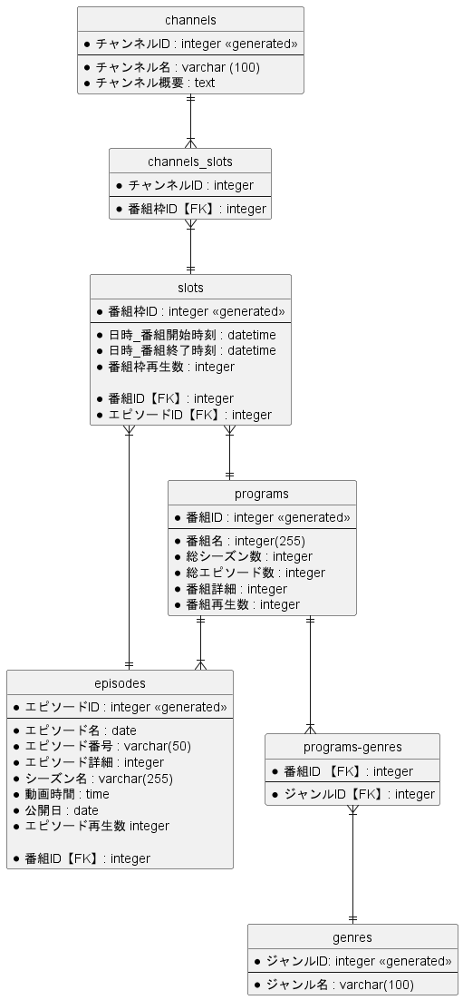

# NetTVデータベース作成手順
1. MySQLにrootユーザー等のデータベース（以下DB）作成権限等をもつ高位のユーザーでアクセスし、任意の名前のDBを作成する（以下DB名を'nettv'とする）。
2. USEコマンドで作成したDBを指定。
3. [./Create_NetTV.sql](./Create_NetTV.sql) のファイル内にあるSQLを上から順に実行する。
4. [.sample_data](./sample_data)フォルダ内のSQLファイルを以下の順に実行する。
    1. [channels.sql](./sample_data/channels.sql)
    2. [genres.sql](./sample_data/genres.sql)
    3. [programs.sql](./sample_data/programs.sql)
    4. [episodes.sql](./sample_data/episodes.sql)
    5. [slots.sql](./sample_data/slots.sql)
    6. [channels_slots.sql](./sample_data/channels_slots.sql)
    7. [programs-genres.sql](./sample_data/programs-genres.sql)

# STEP3のクエリ
[Quest_Queries](./Quest_Queries) のフォルダ内にある各SQLを実行する。クエストの番号とクエリの番号が対応している。

### 補足
3:本日を'2023-11-07'とする。

4:本日を'2023-11-07'とする。特定のチャンネル名'NKK'とする。

5:直近の一週間をそのSQL文を実行した日付（JST）の一週間以内とする。

# テーブル設計
### Channels

| カラム名         | データ型      | NULL | キー      | 初期値           | AUTO INCREMENT |
|------------------|--------------|------|----------|------------------|----------------|
| チャンネルID      | INT          |      | PK |                  | YES            |
| チャンネル名      | VARCHAR(100) |      |          |                  |                |
| チャンネル概要    | TEXT         |      |          |                  |                |

### Slots

| カラム名             | データ型      | NULL | キー      | 初期値           | AUTO INCREMENT |
|----------------------|--------------|------|----------|------------------|----------------|
| 番組枠ID              | INT          |      | PK |                  | YES            |
| 日時_番組開始時刻     | DATETIME     |      |          |                  |                |
| 日時_番組終了時刻     | DATETIME     |      |          |                  |                |
| 番組枠再生数          | INT          |      |          | 0                |                |
| 番組ID              | INT          |      |      FK    |                  |                |
| エピソードID        | INT          |      |        FK  |                  |                |

外部キー制約：番組ID に対して、Programs テーブルの 番組ID カラムから設定

外部キー制約：エピソードID に対して、Episodes テーブルの エピソードID カラムから設定

### Programs

| カラム名         | データ型      | NULL | キー      | 初期値           | AUTO INCREMENT |
|------------------|--------------|------|----------|------------------|----------------|
| 番組ID          | INT          |      | PK |                  | YES            |
| 番組名          | VARCHAR(255) |      |          |                  |                |
| 総シーズン数      | INT          |      |          |                  |                |
| 総エピソード数    | INT          |      |          |                  |                |
| 番組詳細        | TEXT         |      |          |                  |                |
| 番組再生数      | INT          |      |          | 0                |                |

### Episodes

| カラム名         | データ型      | NULL | キー      | 初期値           | AUTO INCREMENT |
|------------------|--------------|------|----------|------------------|----------------|
| エピソードID      | INT          |      | PK |                  | YES            |
| エピソード名      | VARCHAR(255) |      |          |                  |                |
| エピソード番号    | VARCHAR(50)  |   YES   |          |                  |                |
| エピソード詳細    | TEXT         |      |          |                  |                |
| シーズン名        | VARCHAR(255) |   YES   |          |                  |                |
| 動画時間          | TIME         |      |          |                  |                |
| 公開日            | DATE         |      |          |                  |                |
| エピソード再生数  | INT          |      |          | 0                |                |
| 番組ID            | INT          |      |      FK    |                  |                |

外部キー制約：番組ID に対して、Programs テーブルの 番組ID カラムから設定

### Genres

| カラム名         | データ型      | NULL | キー      | 初期値           | AUTO INCREMENT |
|------------------|--------------|------|----------|------------------|----------------|
| ジャンルID      | INT          |      | PK |                  | YES            |
| ジャンル名      | VARCHAR(100) |      |          |                  |                |

## 中間テーブル
### Channels_Slots

| カラム名         | データ型      | NULL | キー      | 初期値           | AUTO INCREMENT |
|------------------|--------------|------|----------|------------------|----------------|
| チャンネルID      | INT          |      |      FK    |                  |                |
| 番組枠ID          | INT          |      |     FK     |                  |                |

ユニークキー制約: (チャンネルID, 番組枠ID) 組み合わせ

外部キー制約：チャンネルID に対して、Channels テーブルの チャンネルID カラムから設定

外部キー制約：番組枠ID に対して、Slots テーブルの 番組枠ID カラムから設定

### Programs_Genres

| カラム名         | データ型      | NULL | キー      | 初期値           | AUTO INCREMENT |
|------------------|--------------|------|----------|------------------|----------------|
| 番組ID          | INT          |      |      FK    |                  |                |
| ジャンルID      | INT          |      |    FK      |                  |                |

ユニークキー制約:(番組ID, ジャンルID) 組み合わせ

外部キー制約：番組ID に対して、Programs テーブルの 番組ID カラムから設定

外部キー制約：ジャンルID に対して、Genres テーブルの ジャンルID カラムから設定

# ER図

